# Auto-Revert on CI Failure Strategy

## Overview

Automatically reverts merged PRs if CI fails after merge, preventing broken main branch.

## Workflow

```mermaid
flowchart TD
    PR[PR Merged to Main] --> Wait[Wait for CI<br/>Max 10 minutes]
    Wait --> Check{CI Result?}

    Check -->|Success| Done[✅ No Action]
    Check -->|Failure| Revert[Create Revert PR]
    Check -->|Timeout| Manual[Manual Check Needed]

    Revert --> Branch[Create auto/revert-pr-N]
    Branch --> RevertPR[Create Revert PR]
    RevertPR --> Issue[Create Investigation Issue]
    Issue --> Notify[Notify Original Author]

    Notify --> Review[Human Reviews<br/>Revert PR]
    Review --> Merge[Merge Revert]
    Merge --> Fix[Author Fixes<br/>Original PR]
    Fix --> Retry[Re-merge After Fix]
```



## Components

### 1. Workflow: `.github/workflows/auto-revert-on-failure.yml`
- **Trigger:** PR closed + merged to main
- **Actions:**
  - Waits up to 10 minutes for CI to complete
  - On CI failure: Calls Python script
  - On CI success: No action

### 2. Script: `scripts/auto_revert_on_failure.py`
- **Monitors:** CI status on main branch
- **Creates:**
  1. Revert branch: `auto/revert-pr-{number}`
  2. Revert PR with auto-label
  3. Investigation issue assigned to author
  4. Comments on original PR

### 3. Fallback: Manual Action Issue
- If automatic revert fails, creates urgent issue
- Provides manual revert commands
- Assigns to repository owner

## Example Flow

### Scenario: PR #102 Merged, CI Fails

1. **Auto-Revert Triggered** (within 10 min of merge)
   ```
   ⏳ Waiting for CI...
   ❌ CI failed: build-and-test
   🚨 Creating revert PR...
   ```

2. **Revert PR Created**: #103
   - Branch: `auto/revert-pr-102`
   - Title: `[AUTO-REVERT] Revert PR #102: Original Title`
   - Labels: `auto-revert`, `urgent`, `bug`
   - Body: Explains what happened, next steps

3. **Investigation Issue Created**: #104
   - Title: `CI Failure Investigation: PR #102`
   - Assigned to: Original PR author
   - Checklist: Review logs, identify cause, fix

4. **Notifications Sent:**
   - Comment on PR #102: "@author PR reverted, see #104"
   - Revert PR #103: Links to issue #104
   - Investigation #104: Assigned to author

5. **Human Action Required:**
   - Review revert PR #103 (usually safe to merge immediately)
   - Merge #103 to restore main
   - Author fixes original PR
   - Re-test and re-merge

## Benefits

✅ **Fast Recovery:** Main branch restored quickly
✅ **Automatic:** No manual revert commands
✅ **Documented:** Investigation issue tracks root cause
✅ **Notified:** Author gets immediate feedback
✅ **Safe:** Human reviews revert before merge

## Configuration

### Enable/Disable
To disable auto-revert:
1. Comment out workflow file
2. Or add condition: `if: false`

### Adjust Timing
Change max wait time in `auto_revert_on_failure.py`:
```python
ci_result = wait_for_ci(repo, max_wait_minutes=10)  # Change here
```

### Customize Labels
Edit labels in `create_revert_pr()`:
```python
revert_pr.add_to_labels("auto-revert", "urgent", "bug")  # Customize
```

## Dependencies

Workflow requires:
- `PyGithub` - Installed during workflow
- `GITHUB_TOKEN` - Automatically provided by Actions
- Branch protection allowing auto-revert PRs

## Testing

Test the workflow without actual revert:

1. **Dry Run:**
   ```bash
   # Set env vars
   export GITHUB_TOKEN="your_token"
   export PR_NUMBER=102
   export PR_TITLE="Test PR"
   export PR_AUTHOR="username"
   export REPO_OWNER="vcaboara"
   export REPO_NAME="job-lead-finder"

   # Run script
   python scripts/auto_revert_on_failure.py
   ```

2. **Trigger Test:**
   - Create test PR with failing test
   - Merge to main
   - Watch workflow execute
   - Verify revert PR and issue created

## Troubleshooting

### Workflow Not Triggering
- Check: Is PR merged? (not just closed)
- Check: Is target branch `main`?
- Check: Workflow file syntax valid?

### Revert PR Creation Fails
- Check: `GITHUB_TOKEN` has write permissions
- Check: Branch protection allows bot PRs
- Fallback: Manual action issue will be created

### CI Check Not Found
- Script looks for check named `build-and-test`
- Update name in `wait_for_ci()` if different

## Related

- **Version Bump:** `.github/workflows/version-bump.yml` - Creates PR for version bumps
- **CI Workflow:** `.github/workflows/ci.yml` - Runs tests
- **Branch Protection:** Requires PR + CI pass

## Future Enhancements

- [ ] Auto-merge revert PR if approved
- [ ] Slack/Discord notifications
- [ ] Metrics dashboard (revert frequency)
- [ ] ML prediction of likely failures
- [ ] Auto-fix common issues before revert
