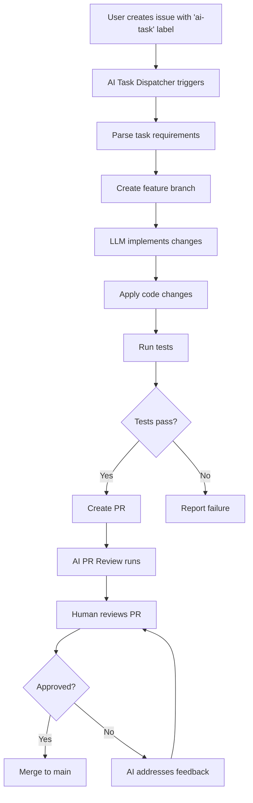

# AI Task Dispatcher

Autonomous AI development system that implements features and fixes from GitHub issues.

## Overview

The AI Task Dispatcher enables autonomous feature development by:
1. Monitoring GitHub issues labeled with `ai-task`
2. Automatically creating feature branches
3. Using LLMs (Claude/GPT-4) to implement requested changes
4. Creating pull requests for human review
5. Handling test creation and documentation updates

## How It Works



## Creating AI Tasks

### 1. Use the Issue Template

Click "New Issue" → "AI Development Task" template

### 2. Fill in Details

**Task Description** (required):
- Clear, specific description of what to implement
- Examples: "Add CSV export for job leads", "Fix job status update bug"

**Context** (optional):
- Related issues, files, or documentation
- Background information for the AI

**Requirements** (optional):
- Specific constraints or standards
- Testing requirements
- Documentation needs

### 3. Submit Issue

Once submitted with the `ai-task` label, the dispatcher automatically:
1. Creates a branch: `ai-task/{issue-number}-{title}`
2. Implements changes using LLM
3. Commits with AI attribution
4. Opens PR for review

## Example AI Task

```yaml
Title: [AI Task] Add job lead export to CSV

Task Description:
Implement a CSV export feature for job leads from the UI.
The export should include all tracked jobs with their current status.

Context:
- See src/app/ui_server.py for existing endpoints
- Job data structure is in src/app/job_tracker.py
- UI is at src/app/templates/tracked_jobs.html

Requirements:
- Add /api/export/csv endpoint
- Include fields: company, title, status, date_applied, link
- Add "Export CSV" button to tracked jobs UI
- Write unit tests for export function
- Handle empty job list gracefully
```

## LLM Providers

The dispatcher tries providers in order:

1. **Anthropic Claude** (preferred):
   - Model: `claude-sonnet-4-20250514`
   - Requires: `ANTHROPIC_API_KEY` secret

2. **OpenAI GPT-4** (fallback):
   - Model: `gpt-4o`
   - Requires: `OPENAI_API_KEY` secret

Configure secrets in: Settings → Secrets and variables → Actions

## Configuration

### Required Secrets

- `ANTHROPIC_API_KEY` or `OPENAI_API_KEY`: LLM API access
- `GITHUB_TOKEN`: Automatically provided by GitHub Actions

### Workflow File

`.github/workflows/ai-task-dispatcher.yml`

### Issue Template

`.github/ISSUE_TEMPLATE/ai-task.yml`

## What the AI Does

### 1. Code Implementation
- Reads relevant files from repository
- Implements requested features/fixes
- Follows project coding standards
- Applies best practices from copilot-instructions.md

### 2. Testing
- Creates unit tests for new functionality
- Aims for >80% code coverage
- Uses existing test patterns

### 3. Documentation
- Updates relevant docs in `docs/`
- Adds docstrings to new functions
- Updates README if needed

### 4. Commit & PR
- Creates detailed commit message
- Opens PR with summary of changes
- Links back to original issue
- Adds AI attribution footer

## Review Process

After AI creates a PR:

1. **Automated AI Review**: vibe-check-mcp reviews code quality
2. **Human Review**: Developer reviews:
   - Correctness of implementation
   - Test coverage
   - Code quality
   - Documentation completeness
3. **Feedback Loop**: If changes needed, can either:
   - Manually update the PR
   - Create new AI task issue for refinement
4. **Merge**: Once approved, merge to main

## Limitations

### What AI Can Do Well
✅ Implement well-defined features
✅ Add endpoints and UI components
✅ Write unit tests
✅ Update documentation
✅ Refactor existing code
✅ Fix bugs with clear reproduction steps

### What AI Struggles With
❌ Highly complex architectural changes
❌ Tasks requiring deep domain knowledge
❌ Features with ambiguous requirements
❌ Changes affecting multiple subsystems
❌ Tasks requiring external service integration

### Token Limits
- Maximum ~8000 tokens for response
- Large files may need to be split
- Complex tasks may need multiple issues

## Best Practices

### Write Clear Tasks
```
❌ "Make the UI better"
✅ "Add job status filter dropdown to tracked jobs UI"

❌ "Fix search"
✅ "Fix JSearch provider to handle pagination when results exceed 10 items"
```

### Provide Context
- Link related issues/PRs
- Reference specific files
- Include error messages for bugs
- Mention existing patterns to follow

### Set Requirements
- Specify test coverage expectations
- Note breaking change constraints
- Indicate documentation needs
- List files that should/shouldn't change

### Review Thoroughly
- AI-generated code needs human review
- Verify logic correctness
- Check edge cases
- Ensure test quality
- Validate security implications

## Troubleshooting

### Task Fails to Execute
1. Check GitHub Actions logs
2. Verify API keys are configured
3. Ensure task description is clear
4. Check for token limit issues

### Poor Implementation Quality
- Task requirements too vague
- Missing context about codebase
- Complex task needs to be split
- May need human implementation instead

### Tests Don't Pass
- AI may misunderstand test framework
- May need manual test fixes
- Consider creating separate test-writing task

### PR Not Created
- Check for git conflicts
- Verify branch protection rules
- Check workflow permissions
- Review error logs in Actions

## Monitoring

View dispatcher activity:
- GitHub Actions → AI Task Dispatcher workflow
- Check issue comments for status updates
- Review created PRs for implementation details

## Future Enhancements

- [ ] Support for task dependencies
- [ ] Iterative refinement based on test failures
- [ ] Integration with vibe-check-mcp for self-review
- [ ] Multi-step task planning
- [ ] Automatic conflict resolution
- [ ] Learning from merged PRs
- [ ] Cost tracking and optimization

## Security Considerations

- AI has write access to repository via Actions
- All changes go through PR review
- Branch protection prevents direct main commits
- API keys stored as encrypted secrets
- AI attribution in all commits for tracking
