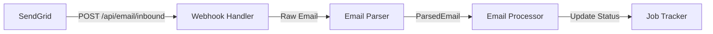

# AI Workflow: Start-to-Finish Example

## Strategy: Use the Right AI for the Job

**Goal**: Minimize premium token usage while maintaining code quality

### Token Economics
- **@copilot (GitHub Copilot)**: 1 premium token per task - Use for initial code creation
- **Ollama (Local LLMs)**: Free - Use for iteration, refinement, debugging

---

## Example: Email Webhook Feature (PR #89 + #90)

### Phase 1: Initial Code Creation (@copilot)
**Cost**: 1 premium token

```bash
# Create Issue or comment on existing issue
gh issue comment 88 --body "@github-copilot Please implement email webhook integration:

1. Create SendGrid webhook endpoint in src/app/email_webhook.py
2. Parse inbound emails in src/app/email_parser.py
3. Add integration tests with .eml fixtures
4. Document setup in docs/EMAIL_WEBHOOK_SETUP.md

Expected completion: 30-45 minutes"
```

**What @copilot delivers**:
- Working initial implementation
- Test structure
- Basic documentation

**Result**: PRs #89 and #90 created with 5,739 lines total

---

### Phase 2: Review & Refinement (Ollama - Free)

#### Step 1: Code Review with Ollama
```bash
# Use Ollama to review the generated code
ollama run qwen2.5-coder:32b "Review this code for security issues:
$(cat src/app/email_webhook.py)"
```

**What Ollama identifies**:
- Path traversal vulnerabilities
- Missing input validation
- Rate limiting needs
- ReDoS risks

#### Step 2: Generate Fixes with Ollama
```bash
# Ask Ollama to generate the fix
ollama run qwen2.5-coder:32b "Generate a fix for path traversal in:
def get_email(self, email_id: str):
    email_path = self.storage_dir / f'{email_id}.json'
    # Add validation here"
```

**Ollama provides**:
```python
def get_email(self, email_id: str):
    # Validate email_id to prevent path traversal
    if not email_id.replace('-', '').isalnum():
        raise ValueError(f"Invalid email_id format: {email_id}")

    email_path = self.storage_dir / f'{email_id}.json'
    # ... rest of implementation
```

#### Step 3: Iterate on Implementation (Ollama - Free)
```bash
# Refine the implementation
ollama run qwen2.5-coder:32b "Add rate limiting to email storage:
$(cat src/app/email_webhook.py)"
```

#### Step 4: Test with Ollama
```bash
# Generate test cases
ollama run qwen2.5-coder:32b "Generate pytest tests for path traversal validation"
```

---

### Phase 3: Documentation (Ollama - Free)

```bash
# Generate architecture diagram in mermaid
ollama run qwen2.5-coder:32b "Create a mermaid flowchart for:
SendGrid -> Webhook -> Parser -> Processor -> JobTracker"
```

**Result**:


---

## Workflow Template

### 1. Initial Creation (@copilot - 1 token)
```bash
gh issue comment <ISSUE_ID> --body "@github-copilot <TASK_DESCRIPTION>"
```

### 2. Review & Fix (Ollama - Free)
```bash
# Review code
ollama run qwen2.5-coder:32b "Review for: security, performance, maintainability
$(cat <FILE>)"

# Generate fixes
ollama run qwen2.5-coder:32b "Fix the identified issues in: $(cat <FILE>)"
```

### 3. Test Generation (Ollama - Free)
```bash
ollama run qwen2.5-coder:32b "Generate pytest tests with parametrization for:
$(cat <FILE>)"
```

### 4. Documentation (Ollama - Free)
```bash
# Generate diagrams
ollama run qwen2.5-coder:32b "Create mermaid diagram showing data flow"

# Generate API docs
ollama run qwen2.5-coder:32b "Generate docstrings in Google style for:
$(cat <FILE>)"
```

---

## Real Example: Security Fix Iteration

### Iteration 1 (@copilot creates)
```python
def get_email(self, email_id: str):
    email_path = self.storage_dir / f'{email_id}.json'  # Vulnerable
```

### Iteration 2 (Ollama reviews & suggests)
```python
def get_email(self, email_id: str):
    if not email_id.replace('-', '').isalnum():  # Better, but...
        raise ValueError(f"Invalid email_id")
```

### Iteration 3 (Ollama refines)
```python
import re

EMAIL_ID_PATTERN = re.compile(r'^[a-zA-Z0-9-]{1,64}$')

def get_email(self, email_id: str):
    """Get stored email by ID.

    Args:
        email_id: Email identifier (alphanumeric + hyphens, max 64 chars)

    Raises:
        ValueError: If email_id format is invalid
        FileNotFoundError: If email not found
    """
    if not EMAIL_ID_PATTERN.match(email_id):
        raise ValueError(
            f"Invalid email_id format: {email_id}. "
            f"Must be alphanumeric with hyphens, max 64 characters."
        )
```

### Iteration 4 (Ollama adds tests)
```python
@pytest.mark.parametrize("invalid_id", [
    "../../../etc/passwd",
    "../../secrets.json",
    "test/../admin",
    "a" * 65,  # Too long
    "test@email",  # Invalid char
    "",  # Empty
])
def test_get_email_rejects_invalid_ids(invalid_id):
    manager = EmailWebhookManager()
    with pytest.raises(ValueError, match="Invalid email_id format"):
        manager.get_email(invalid_id)
```

---

## Benefits of This Approach

### Cost Savings
- **1 premium token** for initial code (@copilot)
- **0 additional tokens** for 10+ refinement iterations (Ollama)
- **Traditional approach**: 11+ premium tokens

### Quality Improvements
- Security review (Ollama)
- Multiple iterations without cost pressure
- Comprehensive test coverage (Ollama)
- Better documentation (Ollama)

### Time Efficiency
- @copilot: Fast initial implementation (16 min for PR #90)
- Ollama: Instant local responses (no API latency)
- Total: ~1-2 hours for production-ready code

---

## Tools Reference

### Ollama Models for Coding
```bash
# Best for code review and refactoring
ollama run qwen2.5-coder:32b

# Good for smaller tasks
ollama run deepseek-coder:33b

# Alternative
ollama run codellama:34b
```

### Ollama Code Assistant Script
```bash
# Use the project's Ollama assistant
python scripts/ollama_code_assistant.py review <file>
python scripts/ollama_code_assistant.py generate-tests <file>
python scripts/ollama_code_assistant.py add-docstrings <file>
```

---

## Next Steps

Apply this workflow to:
1. ✅ Email webhook security fixes (in progress with @copilot)
2. [ ] Ollama assistant library conversion (todo item)
3. [ ] README visual documentation (todo item)
4. [ ] Future features

**Remember**: Use @copilot to create, Ollama to refine!
