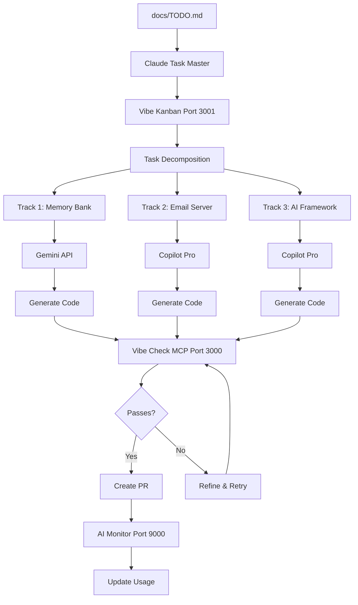

# Autonomous AI Task Execution Guide

Complete setup for AIs to work on TODOs with minimal human interaction using Claude Task Master, Vibe services, and Rulebook-AI.

## Current Infrastructure Status

✅ **Running Services:**
- AI Resource Monitor (Port 9000) - Track usage quotas
- Vibe Check MCP (Port 3000) - Code review & validation
- Vibe Kanban (Port 3001) - Task orchestration
- Main UI (Port 8000) - Job lead finder interface
- Worker Service - Background job processing

✅ **AI Resources Available:**
- GitHub Copilot Pro (1500/month) - Currently: 1500 remaining
- Gemini API (20/day) - Currently: 20 remaining
- Local LLM (Unlimited) - Ollama not detected

## Architecture: Autonomous Task Flow



## Step 1: Install Required Tools

### Claude Task Master (Cline)

**Installation:**
1. Install VS Code extension: "Cline" (formerly Claude Dev)
2. Configure API keys in VS Code settings
3. Enable MCP integration

**Configuration:**

Create `.vscode/settings.json`:

```json
{
  "cline.mcpServers": {
    "vibe-check": {
      "url": "http://localhost:3000",
      "enabled": true
    }
  },
  "cline.autoExecute": true,
  "cline.maxIterations": 10
}
```

### Vibekit Integration

Already running via Docker Compose:

- **Vibe Check MCP**: <http://localhost:3000>
- **Vibe Kanban**: <http://localhost:3001>

Test connection:

```bash
# PowerShell
Invoke-WebRequest -Uri "http://localhost:3000/health" -UseBasicParsing
Invoke-WebRequest -Uri "http://localhost:3001/health" -UseBasicParsing
```

## Step 2: Configure Rulebook-AI for Autonomous Mode

### Update Memory Bank (P0 - Required First)

```bash
# Install rulebook-ai if not already
pip install -e ".[rulebook]"

# Initialize memory bank structure
python scripts/init_memory_bank.py
```

This creates:

- `memory/docs/architecture.md` - System architecture
- `memory/docs/technical.md` - Tech stack & setup
- `memory/tasks/tasks_plan.md` - Current roadmap
- `memory/tasks/active_context.md` - Work focus

### Sync AI Instructions

```bash
# Generate instructions for all AI assistants
python -m rulebook_ai project sync

# This creates/updates:
# - .github/copilot-instructions.md (GitHub Copilot)
# - .cursor/rules/* (Cursor AI)
# - .roo/* (Roo Code)
```

## Step 3: Create Autonomous Task Execution Script

Save as `scripts/autonomous_task_executor.py`:

```python
#!/usr/bin/env python3
"""
Autonomous Task Executor
Reads TODOs, assigns to AI agents, monitors progress, creates PRs.
"""

import json
import re
import subprocess
from pathlib import Path
from typing import Dict, List

import httpx


class TaskOrchestrator:
    """Orchestrate tasks across AI agents with minimal human interaction."""

    def __init__(self):
        self.kanban_url = "http://localhost:3001"
        self.vibe_check_url = "http://localhost:3000"
        self.monitor_url = "http://localhost:9000"
        self.todo_file = Path("docs/TODO.md")

    def parse_todos(self) -> List[Dict]:
        """Parse TODO.md and extract actionable tasks."""
        content = self.todo_file.read_text(encoding="utf-8")

        tasks = []
        current_priority = None
        current_track = None

        for line in content.split("\n"):
            # Priority headers
            if re.match(r"###\s+P\d", line):
                current_priority = line.strip().split()[1]  # P0, P1, P2

            # Track headers
            if re.match(r"\*\*Track \d+:", line):
                match = re.search(r"Track (\d+):\s+(.+?)\*\*", line)
                if match:
                    current_track = {
                        "id": int(match.group(1)),
                        "name": match.group(2),
                        "priority": current_priority,
                        "items": []
                    }
                    tasks.append(current_track)

            # Task items
            if line.strip().startswith("- [ ]") and current_track:
                task_text = line.strip()[6:]  # Remove "- [ ] "
                current_track["items"].append({
                    "description": task_text,
                    "completed": False
                })

        return tasks

    def get_resource_allocation(self) -> Dict:
        """Check AI resource availability."""
        try:
            response = httpx.get(f"{self.monitor_url}/api/metrics", timeout=5)
            return response.json()
        except Exception:
            return {
                "copilot": {"remaining": 1500},
                "gemini": {"remaining": 20},
                "ollama": {"status": "unknown"}
            }

    def assign_agent(self, track: Dict, resources: Dict) -> str:
        """Assign optimal AI agent based on task and available resources."""
        priority = track.get("priority", "P3")
        track_id = track.get("id", 0)

        # P0: Memory Bank - Use Gemini (free, good for docs)
        if priority == "P0" or track_id == 1:
            if resources["gemini"]["remaining"] > 5:
                return "gemini"

        # High complexity - Use Copilot if available
        if priority in ["P1", "P2"]:
            if resources["copilot"]["remaining"] > 50:
                return "copilot"

        # Fallback to local LLM
        if resources.get("ollama", {}).get("status") == "running":
            return "local"

        # Last resort - Gemini
        return "gemini"

    def create_kanban_task(self, track: Dict, agent: str) -> int:
        """Create task in Vibe Kanban."""
        try:
            response = httpx.post(
                f"{self.kanban_url}/api/tasks",
                json={
                    "title": track["name"],
                    "track": track["id"],
                    "priority": track["priority"],
                    "agent": agent,
                    "items": track["items"],
                    "status": "backlog"
                },
                timeout=5
            )
            return response.json().get("id")
        except Exception as e:
            print(f"Error creating Kanban task: {e}")
            return None

    def execute_track(self, track: Dict, agent: str) -> bool:
        """Execute a track using assigned AI agent."""
        print(f"\n🚀 Executing Track {track['id']}: {track['name']}")
        print(f"   Agent: {agent}")
        print(f"   Priority: {track['priority']}")

        # Create branch for this track
        branch_name = f"auto/track-{track['id']}-{track['name'].lower().replace(' ', '-')}"
        subprocess.run(["git", "checkout", "-b", branch_name], check=False)

        # Execute each task item
        for idx, item in enumerate(track["items"], 1):
            print(f"   [{idx}/{len(track['items'])}] {item['description']}")

            # TODO: Integrate with Claude Code Settings / Task Master
            # This would call the AI agent to actually implement the task
            # For now, this is a placeholder for the automation

        return True

    def validate_with_vibe_check(self, files: List[str]) -> Dict:
        """Validate changes with Vibe Check MCP."""
        try:
            response = httpx.post(
                f"{self.vibe_check_url}/validate",
                json={"files": files},
                timeout=30
            )
            return response.json()
        except Exception as e:
            print(f"Vibe Check validation error: {e}")
            return {"passed": False, "errors": [str(e)]}

    def run_autonomous_cycle(self):
        """Main autonomous execution cycle."""
        print("=" * 60)
        print("🤖 AUTONOMOUS TASK EXECUTOR")
        print("=" * 60)

        # 1. Parse TODOs
        print("\n📋 Parsing tasks from docs/TODO.md...")
        tasks = self.parse_todos()
        print(f"   Found {len(tasks)} tracks")

        # 2. Check resources
        print("\n📊 Checking AI resource availability...")
        resources = self.get_resource_allocation()
        print(f"   Copilot: {resources['copilot']['remaining']}/1500")
        print(f"   Gemini: {resources['gemini']['remaining']}/20")

        # 3. Assign agents and create Kanban tasks
        print("\n🎯 Assigning AI agents to tracks...")
        for track in tasks:
            if track["priority"] in ["P0", "P1"]:  # Only auto-execute P0 and P1
                agent = self.assign_agent(track, resources)
                task_id = self.create_kanban_task(track, agent)

                print(f"   Track {track['id']}: {track['name']}")
                print(f"      → Agent: {agent}")
                print(f"      → Kanban ID: {task_id}")

        # 4. Execute P0 first (Memory Bank)
        p0_tasks = [t for t in tasks if t["priority"] == "P0"]
        for track in p0_tasks:
            agent = self.assign_agent(track, resources)
            self.execute_track(track, agent)

        print("\n✅ Autonomous cycle complete!")
        print("   View progress: http://localhost:3001")
        print("   Monitor usage: http://localhost:9000")


if __name__ == "__main__":
    orchestrator = TaskOrchestrator()
    orchestrator.run_autonomous_cycle()
```

## Step 4: Enable Claude Code Settings Integration

Create `.claude/settings.json`:

```json
{
  "autonomousMode": {
    "enabled": true,
    "maxIterations": 10,
    "requireApproval": false,
    "autoCommit": true,
    "autoPush": false,
    "branchPrefix": "auto/"
  },
  "mcpServers": {
    "vibe-check": {
      "url": "http://localhost:3000",
      "validateBeforeCommit": true
    },
    "vibe-kanban": {
      "url": "http://localhost:3001",
      "trackProgress": true
    }
  },
  "taskSources": [
    "docs/TODO.md",
    "memory/tasks/tasks_plan.md"
  ],
  "agentAllocation": {
    "P0": "gemini",
    "P1": "copilot",
    "P2": "local",
    "P3": "local"
  }
}
```

## Step 5: Run Autonomous Execution

### Option A: Manual Trigger

```bash
# Start autonomous task execution
python scripts/autonomous_task_executor.py
```

### Option B: Continuous Mode (Recommended)

```bash
# Run in background, check every hour
while ($true) {
    python scripts/autonomous_task_executor.py
    Start-Sleep -Seconds 3600
}
```

### Option C: GitHub Actions (Future)

Create `.github/workflows/autonomous-tasks.yml` to run on schedule.

## Monitoring & Control

### Real-time Dashboards

1. **Vibe Kanban** (<http://localhost:3001>)
   - View all tracks and their progress
   - See which AI agent is working on what
   - Monitor completion status

2. **AI Resource Monitor** (<http://localhost:9000>)
   - Track API quota usage
   - See remaining requests
   - Get optimization recommendations

3. **Vibe Check MCP** (<http://localhost:3000>)
   - View validation results
   - See code quality metrics
   - Review architectural compliance

### Manual Intervention Points

You only need to interact when:

1. **PR Review** - Final approval before merge
2. **Resource Exhausted** - Copilot or Gemini quota hit
3. **Validation Failed** - Vibe Check reports critical issues
4. **Conflicts** - Git merge conflicts require resolution

## Workflow Example

### Day 1: P0 - Memory Bank Documentation

**Automatic Execution:**

1. `autonomous_task_executor.py` reads TODO.md
2. Detects Track 1 (Memory Bank) as P0
3. Assigns Gemini API (20 requests available)
4. Creates Kanban task at <http://localhost:3001>
5. Generates `memory/docs/architecture.md` (uses 5 Gemini requests)
6. Generates `memory/docs/technical.md` (uses 5 Gemini requests)
7. Generates `memory/tasks/tasks_plan.md` (uses 5 Gemini requests)
8. Validates with Vibe Check MCP
9. Creates PR: `auto/track-1-memory-bank-documentation`
10. Notifies you for review

**Your Action:**
- Review PR (5 minutes)
- Merge if approved
- Script continues to Track 2

### Day 2: P1 - Email Server Integration

**Automatic Execution:**

1. Detects Track 2 as P1
2. Assigns Copilot Pro (1500 requests available)
3. Implements email server setup
4. Implements job parsing pipeline
5. Implements auto-resume generation
6. Runs tests
7. Validates with Vibe Check
8. Creates PR

**Your Action:**
- Review PR
- Test email integration manually
- Merge

## Advanced Configuration

### Custom Agent Preferences

Edit `scripts/autonomous_task_executor.py`:

```python
def assign_agent(self, track: Dict, resources: Dict) -> str:
    """Customize agent assignment logic."""

    # Force specific tracks to specific agents
    agent_map = {
        1: "gemini",      # Memory Bank → Gemini
        2: "copilot",     # Email Server → Copilot
        3: "copilot",     # AI Framework → Copilot
        4: "local",       # Learning System → Local LLM
    }

    return agent_map.get(track["id"], "gemini")
```

### Rate Limiting

Prevent quota exhaustion:

```python
def should_execute_now(self, agent: str, resources: Dict) -> bool:
    """Check if we should execute now or wait."""

    if agent == "copilot" and resources["copilot"]["remaining"] < 100:
        return False  # Save for critical tasks

    if agent == "gemini" and resources["gemini"]["remaining"] < 5:
        return False  # Wait for quota reset

    return True
```

## Troubleshooting

### Vibe Services Not Responding

```bash
# Check service health
docker compose ps
docker compose logs vibe-check-mcp
docker compose logs vibe-kanban

# Restart if needed
docker compose restart vibe-check-mcp vibe-kanban
```

### AI Agent Quota Exhausted

```bash
# Check current usage
Invoke-WebRequest -Uri "http://localhost:9000/api/metrics" -UseBasicParsing

# Wait for reset or switch agents
# Copilot: Monthly reset
# Gemini: Daily reset (24 hours)
```

### Task Execution Fails

1. Check `.claude/settings.json` configuration
2. Verify MCP server connections
3. Review Vibe Check validation errors
4. Check git branch state

## Next Steps

1. **Run P0**: Execute autonomous cycle to complete Memory Bank
2. **Verify**: Check generated docs in `memory/`
3. **Sync**: Run `python -m rulebook_ai project sync`
4. **Continue**: System auto-executes P1 and P2 tracks
5. **Monitor**: Watch dashboards for progress

The system is now configured for autonomous operation with minimal human interaction!
