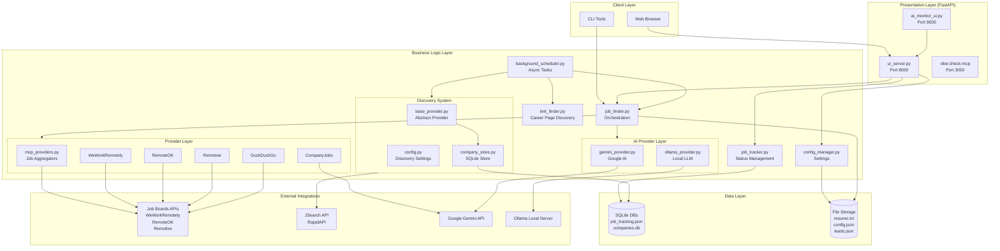
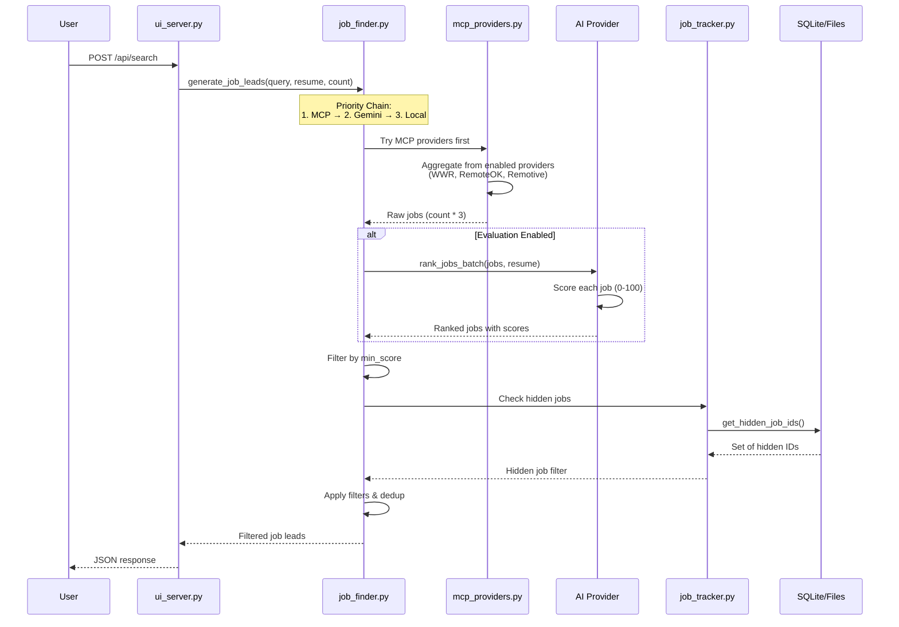
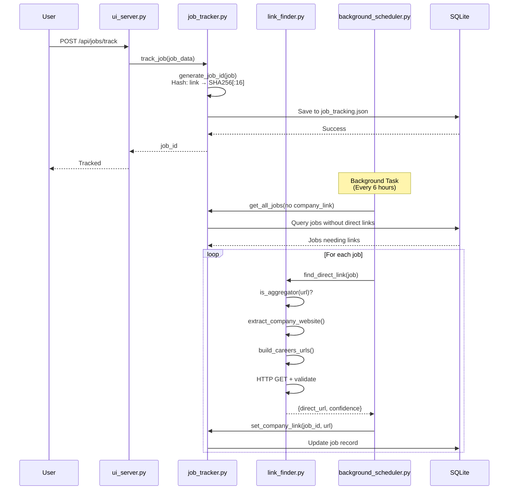
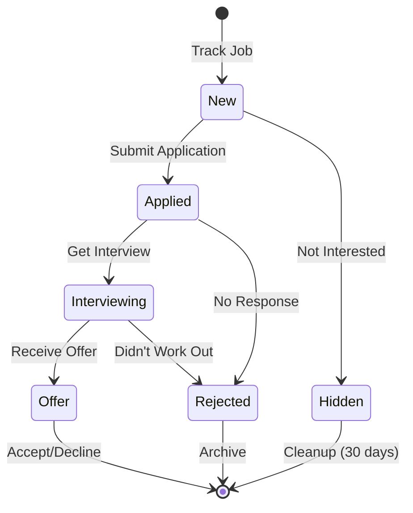
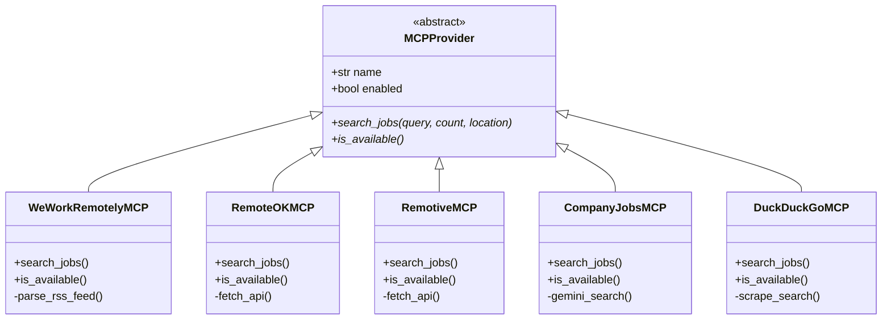
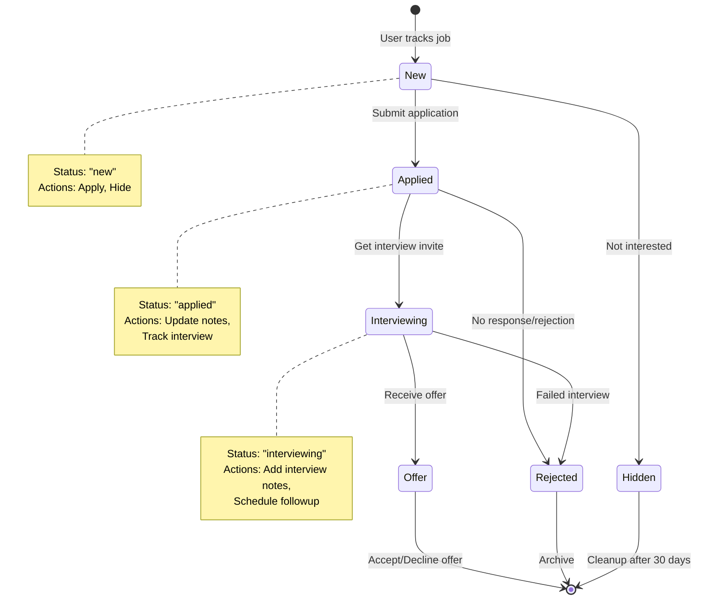
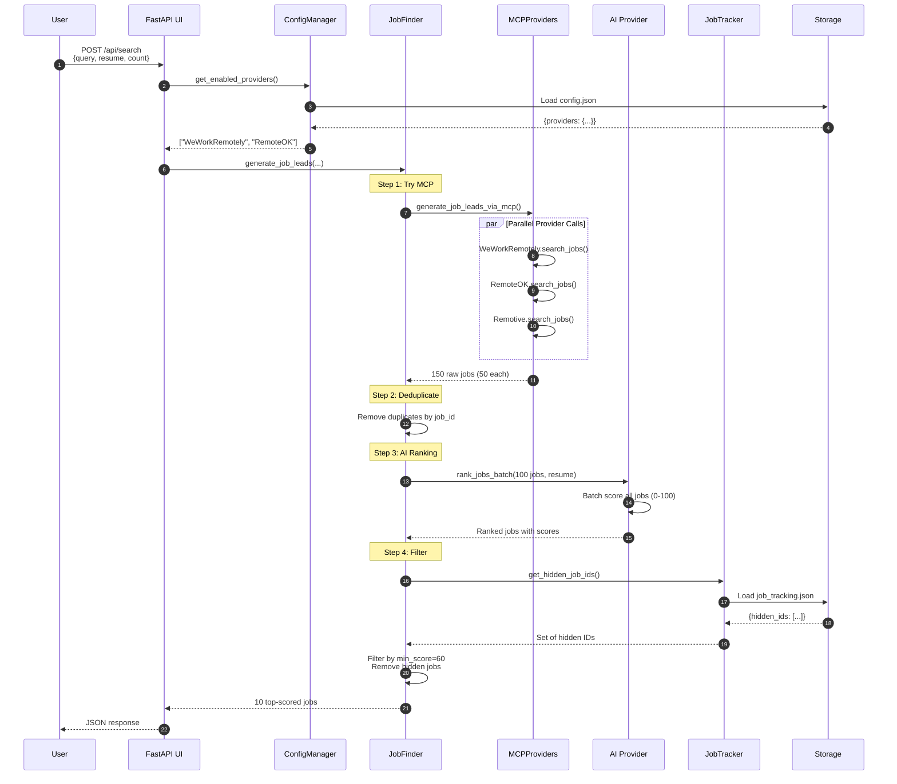

# Job Lead Finder - Architecture Analysis

## Executive Summary

Job Lead Finder is a multi-tier AI-powered job search and application tracking system built with Python, FastAPI, and SQLite. It aggregates jobs from multiple sources (job boards, company career pages), evaluates them using AI models (Gemini, Ollama), and provides a comprehensive web UI for tracking applications through the hiring funnel.

**Key Architecture Patterns:**
- **Layered Architecture**: Presentation (FastAPI UI) → Business Logic (job_finder, mcp_providers) → Data (SQLite, JSON)
- **Provider Pattern**: Pluggable job sources via abstract base class
- **Async Task Processing**: Background scheduler for automated discovery
- **Fallback Chain**: Graceful degradation (MCP → AI → Local fallback)
- **Microservices**: Docker-compose orchestration of 5 services

---

## 1. System Architecture

### 1.1 High-Level Component Diagram



### 1.2 Data Flow - Job Search Request



### 1.3 Data Flow - Application Tracking



---

## 2. Key Modules Deep Dive

### 2.1 Job Finder (`src/app/job_finder.py`)

**Purpose**: Orchestrates job search across multiple sources with intelligent fallback.

**Key Functions:**
- `generate_job_leads()`: Main entry point with provider priority chain
- `_get_evaluation_provider()`: Auto-selects best AI provider (Ollama → Gemini)
- `_evaluate_leads()`: Individual job scoring (deprecated, use batch ranking)

**Provider Priority Chain:**
```
1. MCP Providers (if use_mcp=True)
   ↓ (on failure)
2. Gemini Provider (if API key configured)
   ↓ (on failure)
3. Local Sample Data (hardcoded fallback)
```

**AI Evaluation Flow:**
```python
# Request 3x jobs from each MCP
count_per_mcp = count * 3  # e.g., 15 for count=5

# Get raw jobs
leads = generate_job_leads_via_mcp(count=count*3)

# Batch rank with AI
provider = _get_evaluation_provider()  # Ollama or Gemini
leads = provider.rank_jobs_batch(leads, resume_text, top_n=count)

# Returns top N scored jobs
```

**Integration Points:**
- `mcp_providers.py`: Job aggregation
- `gemini_provider.py`, `ollama_provider.py`: AI scoring
- `config_manager.py`: Provider enable/disable

### 2.2 MCP Providers (`src/app/mcp_providers.py`)

**Purpose**: Abstract interface for job sources with pluggable providers.

**Base Class Pattern:**
```python
class MCPProvider(ABC):
    @abstractmethod
    def search_jobs(self, query, count, location, **kwargs) -> List[Dict]:
        """Returns standardized job schema"""

    @abstractmethod
    def is_available(self) -> bool:
        """Health check for provider"""
```

**Implemented Providers:**

| Provider          | Type         | API             | Status       | Notes                                     |
| ----------------- | ------------ | --------------- | ------------ | ----------------------------------------- |
| WeWorkRemotelyMCP | RSS/HTML     | Public RSS feed | ✅ Active     | Migrated to `providers/weworkremotely.py` |
| RemoteOKMCP       | REST API     | Public JSON API | ✅ Active     | No auth required                          |
| RemotiveMCP       | REST API     | Public JSON API | ✅ Active     | No auth required                          |
| CompanyJobsMCP    | AI-powered   | Gemini + Search | ⚠️ Limited    | Requires GEMINI_API_KEY, quota limits     |
| DuckDuckGoMCP     | Web scraping | HTML parsing    | ⚠️ Fallback   | Rate limits, unreliable                   |
| LinkedInMCP       | MCP Server   | HTTP API        | ⚠️ Deprecated | Requires external server                  |
| IndeedMCP         | MCP Server   | HTTP API        | ⚠️ Deprecated | Requires external server                  |
| GitHubJobsMCP     | GitHub API   | REST API        | ⚠️ Deprecated | Limited job postings                      |

**Job Schema Normalization:**
```python
{
    "title": str,        # Job title
    "company": str,      # Company name
    "location": str,     # Location or "Remote"
    "summary": str,      # Job description (truncated)
    "link": str,         # Application URL
    "source": str        # Provider name
}
```

**Provider Selection:**
```python
def generate_job_leads_via_mcp(query, count, count_per_provider, location):
    enabled = get_enabled_providers()  # From config.json
    results = []

    for provider_class in [WeWorkRemotelyMCP, RemoteOKMCP, RemotiveMCP, ...]:
        if provider_class.name in enabled and provider.is_available():
            jobs = provider.search_jobs(query, count_per_provider, location)
            results.extend(jobs)

    return deduplicate(results)  # By link hash
```

### 2.3 Job Tracker (`src/app/job_tracker.py`)

**Purpose**: State management for job applications with status workflow.

**Job Lifecycle:**


**Status Constants:**
```python
STATUS_NEW = "new"           # Just discovered
STATUS_APPLIED = "applied"   # Application submitted
STATUS_INTERVIEWING = "interviewing"
STATUS_REJECTED = "rejected"
STATUS_OFFER = "offer"
STATUS_HIDDEN = "hidden"     # User not interested
```

**Job ID Generation:**
```python
def generate_job_id(job) -> str:
    """Stable ID based on job link or title+company"""
    link = job.get("link", "")
    if link:
        return hashlib.sha256(link.encode()).hexdigest()[:16]

    # Fallback: title + company
    key = f"{company}::{title}"
    return hashlib.sha256(key.encode()).hexdigest()[:16]
```

**Data Model:**
```python
{
    "job_id": str,           # SHA256 hash
    "title": str,
    "company": str,
    "location": str,
    "summary": str,
    "link": str,             # Aggregator link
    "source": str,           # Provider name
    "status": str,           # See STATUS_* constants
    "notes": str,            # User notes
    "company_link": str,     # Direct career page (optional)
    "applied_date": str,     # ISO timestamp
    "first_seen": str,       # ISO timestamp
    "last_updated": str      # ISO timestamp
}
```

**Persistence:**
- **File**: `data/job_tracking.json`
- **Format**: JSON with `jobs` dict and `last_updated` timestamp
- **Thread-safe**: Uses file locks for concurrent access

### 2.4 UI Server (`src/app/ui_server.py`)

**Purpose**: FastAPI web application serving HTML UI and REST API.

**Key Endpoints:**

| Endpoint                         | Method | Purpose                      |
| -------------------------------- | ------ | ---------------------------- |
| `/`                              | GET    | Main job search UI           |
| `/dashboard`                     | GET    | Service overview dashboard   |
| `/visual-kanban`                 | GET    | AI task tracking Kanban      |
| `/api/search`                    | POST   | Job search with filters      |
| `/api/search/progress/{id}`      | GET    | Real-time search progress    |
| `/api/jobs/tracked`              | GET    | Get all tracked jobs         |
| `/api/jobs/track`                | POST   | Track a new job              |
| `/api/jobs/{id}/status`          | POST   | Update job status            |
| `/api/jobs/{id}/hide`            | POST   | Hide unwanted job            |
| `/api/jobs/{id}/company-link`    | POST   | Set direct career page link  |
| `/api/jobs/{id}/notes`           | POST   | Add/update notes             |
| `/api/jobs/{id}/cover-letter`    | POST   | Generate AI cover letter     |
| `/api/resume/upload`             | POST   | Upload resume (txt/pdf/docx) |
| `/api/config`                    | GET    | Get current configuration    |
| `/api/job-config/provider/{key}` | POST   | Enable/disable provider      |
| `/api/validate-link`             | POST   | Check if link is valid       |
| `/api/auto-discover/trigger`     | POST   | Trigger company discovery    |

**Resume Upload Flow:**
```python
@app.post("/api/resume/upload")
async def upload_resume(file: UploadFile):
    # 1. File type validation
    if file.filename.endswith('.txt'):
        text = await file.read()
    elif file.filename.endswith('.pdf'):
        text = extract_pdf_text(file)  # pypdf
    elif file.filename.endswith('.docx'):
        text = extract_docx_text(file)  # python-docx
    else:
        raise HTTPException(400, "Unsupported format")

    # 2. Security scanning
    if scan_instructions(text) or scan_entity(text):
        raise HTTPException(400, "Potential injection detected")

    # 3. Save to persistent storage
    RESUME_FILE.write_text(text, encoding='utf-8')
    return {"status": "success"}
```

**Real-time Progress Tracking:**
```python
search_progress: Dict[str, dict] = {}

@app.post("/api/search")
async def search_jobs(req: SearchRequest):
    search_id = f"search_{int(time.time())}"
    search_progress[search_id] = {
        "status": "processing",
        "current_step": "Initializing...",
        "progress": 0,
        "results": []
    }

    # Run search in background
    asyncio.create_task(run_search_async(search_id, req))
    return {"search_id": search_id}

@app.get("/api/search/progress/{search_id}")
async def get_progress(search_id: str):
    return search_progress.get(search_id, {"status": "not_found"})
```

### 2.5 AI Providers

#### 2.5.1 Gemini Provider (`src/app/gemini_provider.py`)

**Purpose**: Google AI integration for job evaluation and cover letter generation.

**Model Selection:**
```python
# Default: gemini-2.5-flash-preview-09-2025
# Supports: google_search tool for web grounding
```

**Key Methods:**

```python
class GeminiProvider:
    def evaluate(self, job: Dict, resume_text: str) -> Dict:
        """Single job evaluation (0-100 score + reasoning)"""

    def rank_jobs_batch(self, jobs: List[Dict], resume_text: str, top_n: int) -> List[Dict]:
        """Batch ranking for efficiency - PREFERRED METHOD"""

    def generate_job_leads(self, query: str, resume_text: str, count: int) -> List[Dict]:
        """Gemini-powered job search using google_search tool"""

    def generate_cover_letter(self, job: Dict, resume_text: str) -> str:
        """AI-generated custom cover letter"""
```

**Evaluation Rubric:**
```
SCORING CRITERIA (0-100 total):
1. Required Skills Match (40 points)
   - Count matching technical skills
   - Weight by importance

2. Experience Level (25 points)
   - Junior/Mid/Senior alignment
   - Years of experience match

3. Domain Knowledge (20 points)
   - Industry experience
   - Sector-specific expertise

4. Role Fit (15 points)
   - Career trajectory alignment
   - Job responsibilities match
```

**Batch Ranking (Optimized):**
```python
# Instead of N API calls (slow, expensive):
for job in jobs:
    result = provider.evaluate(job, resume)

# Use single batch call (fast, efficient):
ranked_jobs = provider.rank_jobs_batch(jobs, resume, top_n=10)

# Returns: Top N jobs sorted by score with reasoning
```

#### 2.5.2 Ollama Provider (`src/app/ollama_provider.py`)

**Purpose**: Local LLM integration for unlimited, free AI evaluation.

**Advantages:**
- ✅ No API costs or quotas
- ✅ Complete privacy (data never leaves machine)
- ✅ Works offline
- ✅ Fast inference with GPU

**Recommended Models:**
```python
# Default: llama3.2:3b (2GB VRAM, fast)
# Better quality: qwen2.5:7b (4GB VRAM)
# Best balance: llama3.1:8b (5GB VRAM)
```

**Configuration:**
```python
OLLAMA_BASE_URL = "http://localhost:11434"  # Default
OLLAMA_MODEL = "llama3.2:3b"                # Override in .env
```

**Evaluation Method:**
```python
def evaluate(self, job: Dict, resume_text: str) -> Dict:
    prompt = f"""
    Evaluate this job-candidate match (0-100 score).
    Respond with ONLY valid JSON.

    CANDIDATE: {resume_text[:1500]}
    JOB: {job['title']} at {job['company']}

    Format: {{"score": 75, "reasoning": "..."}}
    """

    response = httpx.post(
        f"{self.base_url}/api/generate",
        json={
            "model": self.model,
            "prompt": prompt,
            "stream": False,
            "format": "json",  # Enforce JSON output
            "options": {
                "temperature": 0.2,  # Consistent scoring
                "num_predict": 256
            }
        }
    )

    return parse_json(response.json()["response"])
```

**Provider Selection Logic:**
```python
def _get_evaluation_provider():
    """Auto-select best available AI provider"""

    # 1. Try Ollama first (local, unlimited)
    try:
        provider = OllamaProvider()
        if provider.is_available():
            return provider
    except:
        pass

    # 2. Fallback to Gemini (cloud, quota limits)
    try:
        provider = GeminiProvider()
        return provider
    except:
        pass

    # 3. No AI available
    return None
```

### 2.6 Background Scheduler (`src/app/background_scheduler.py`)

**Purpose**: Async task orchestration using APScheduler.

**Scheduled Tasks:**

| Task                                   | Interval     | Purpose                                           |
| -------------------------------------- | ------------ | ------------------------------------------------- |
| `find_direct_links_for_tracked_jobs()` | 6 hours      | Find direct career page links for aggregator jobs |
| `cleanup_old_hidden_jobs()`            | Daily        | Remove hidden jobs older than 30 days             |
| `run_auto_discovery()`                 | Configurable | Discover new companies matching resume            |

**Direct Link Discovery:**
```python
async def find_direct_links_for_tracked_jobs():
    tracker = JobTracker()
    jobs = tracker.get_all_jobs(include_hidden=False)

    # Filter jobs from aggregators without direct link
    jobs_needing_links = [
        job for job in jobs
        if not job.get("company_link")
        and job.get("source") != "CompanyJobs"
    ]

    for job in jobs_needing_links:
        result = await find_direct_link(job, timeout=5)

        if result and result.get("direct_url"):
            tracker.set_company_link(job["job_id"], result["direct_url"])
            logger.info(f"Found: {result['direct_url']} ({result['confidence']})")

        await asyncio.sleep(2)  # Rate limiting
```

**Auto-Discovery:**
```python
async def run_auto_discovery():
    """Passive job discovery matching user's resume"""

    # 1. Load user's resume
    if not RESUME_FILE.exists():
        return
    resume = RESUME_FILE.read_text()

    # 2. Extract skills/roles from resume
    skills = extract_skills(resume)
    query = " OR ".join(skills[:5])

    # 3. Search via JSearch API
    companies = discover_companies(query, tech_stack=skills)

    # 4. Store in company database
    store = CompanyStore()
    for company in companies:
        store.save_company(company)

    # 5. Crawl career pages for jobs
    for company in companies:
        jobs = crawl_career_page(company.careers_url)
        for job in jobs:
            store.save_job(company.id, job)
```

### 2.7 Link Finder (`src/app/link_finder.py`)

**Purpose**: Discover direct application links from aggregator postings.

**Problem**: Aggregator links (Indeed, LinkedIn) are slow, tracked, require logins.

**Solution**: Find company's direct career page for faster, cleaner application.

**Algorithm:**
```python
async def find_direct_link(job_data: Dict, timeout: int = 5) -> Dict:
    # 1. Check if already a direct link
    if not is_aggregator(job_data["link"]):
        return {"direct_url": job_data["link"], "confidence": "high"}

    # 2. Extract company website from job data
    company_url = extract_company_website(job_data)
    if not company_url:
        return None

    # 3. Generate potential career page URLs
    career_urls = build_careers_urls(company_url)
    # e.g., ["https://example.com/careers",
    #        "https://example.com/jobs",
    #        "https://example.com/join-us"]

    # 4. Test each URL with HTTP HEAD request
    for url in career_urls:
        try:
            async with httpx.AsyncClient() as client:
                resp = await client.head(url, timeout=timeout)
                if resp.status_code == 200:
                    return {
                        "direct_url": url,
                        "confidence": "high",
                        "method": "pattern_match"
                    }
        except:
            continue

    # 5. Fallback: Return company homepage
    return {
        "direct_url": company_url,
        "confidence": "low",
        "method": "homepage"
    }
```

**Career Page Patterns:**
```python
CAREERS_PATHS = [
    "/careers", "/jobs", "/join-us",
    "/work-with-us", "/opportunities",
    "/employment", "/apply", "/openings"
]
```

**Aggregator Detection:**
```python
AGGREGATOR_DOMAINS = {
    "indeed.com", "linkedin.com", "glassdoor.com",
    "monster.com", "ziprecruiter.com", "careerbuilder.com"
}

def is_aggregator(url: str) -> bool:
    domain = urlparse(url).netloc.lower().replace("www.", "")
    return any(agg in domain for agg in AGGREGATOR_DOMAINS)
```

### 2.8 Discovery System (`src/app/discovery/`)

**Purpose**: Proactive company discovery for passive job hunting.

**Components:**

#### Base Provider (`base_provider.py`)
```python
@dataclass
class Company:
    name: str
    website: str
    careers_url: Optional[str]
    industry: IndustryType
    size: CompanySize
    tech_stack: List[str]
    locations: List[str]
    funding_stage: Optional[str]
    discovered_via: str
    discovered_at: datetime
    metadata: dict

class DiscoveryProvider(ABC):
    @abstractmethod
    async def discover(self, filters: Dict) -> DiscoveryResult:
        """Discover companies matching criteria"""
```

#### Company Store (`company_store.py`)

**Database Schema:**
```sql
-- Companies table
CREATE TABLE companies (
    id INTEGER PRIMARY KEY,
    name TEXT NOT NULL,
    website TEXT UNIQUE NOT NULL,
    careers_url TEXT,
    industry TEXT NOT NULL,
    size TEXT NOT NULL,
    description TEXT,
    tech_stack TEXT,  -- JSON array
    locations TEXT,   -- JSON array
    funding_stage TEXT,
    discovered_via TEXT NOT NULL,
    discovered_at TEXT NOT NULL,
    last_checked TEXT,
    active INTEGER DEFAULT 1,
    metadata TEXT,    -- JSON object
    created_at TEXT DEFAULT CURRENT_TIMESTAMP,
    updated_at TEXT DEFAULT CURRENT_TIMESTAMP
);

-- Jobs from discovered companies
CREATE TABLE jobs (
    id INTEGER PRIMARY KEY,
    company_id INTEGER NOT NULL,
    title TEXT NOT NULL,
    url TEXT UNIQUE NOT NULL,
    description TEXT,
    location TEXT,
    posted_date TEXT,
    first_seen TEXT NOT NULL,
    last_seen TEXT NOT NULL,
    active INTEGER DEFAULT 1,
    metadata TEXT,
    FOREIGN KEY (company_id) REFERENCES companies(id)
);

-- Discovery audit log
CREATE TABLE discovery_log (
    id INTEGER PRIMARY KEY,
    source TEXT NOT NULL,
    timestamp TEXT NOT NULL,
    companies_found INTEGER,
    companies_new INTEGER,
    companies_updated INTEGER,
    errors TEXT,
    metadata TEXT,
    duration_seconds REAL
);
```

**Key Methods:**
```python
class CompanyStore:
    def save_company(self, company: Company) -> int:
        """Insert or update company, return ID"""

    def find_companies(
        self,
        industries: List[IndustryType] = None,
        sizes: List[CompanySize] = None,
        tech_stack: List[str] = None,
        locations: List[str] = None
    ) -> List[Company]:
        """Query companies with filters"""

    def save_job(self, company_id: int, job: Dict) -> int:
        """Associate job with company"""

    def get_discovery_stats(self, source: str = None) -> Dict:
        """Get discovery metrics"""
```

---

## 3. Data Models

### 3.1 Job Schema (Standardized)

```python
{
    # Core fields (all providers)
    "title": str,        # "Senior Python Developer"
    "company": str,      # "TechCorp Inc."
    "location": str,     # "Remote" | "San Francisco, CA"
    "summary": str,      # Job description (truncated to 500 chars)
    "link": str,         # Application URL
    "source": str,       # Provider name ("WeWorkRemotely", "RemoteOK", etc.)

    # Optional fields
    "description": str,  # Full job description
    "salary": str,       # "120k-160k USD" (if available)
    "posted_date": str,  # ISO timestamp
    "tags": List[str],   # ["Python", "Django", "AWS"]

    # AI evaluation fields (if evaluate=True)
    "score": int,        # 0-100 match score
    "reasoning": str,    # "Python, AWS, Docker match. Senior level fits."

    # Tracking fields (after tracking)
    "job_id": str,       # SHA256 hash of link
    "status": str,       # new|applied|interviewing|rejected|offer|hidden
    "notes": str,        # User notes
    "company_link": str, # Direct career page URL
    "applied_date": str, # ISO timestamp
    "first_seen": str,   # ISO timestamp
    "last_updated": str  # ISO timestamp
}
```

### 3.2 Company Schema (Discovery System)

```python
{
    "id": int,                    # Database ID
    "name": str,                  # "Stripe"
    "website": str,               # "https://stripe.com"
    "careers_url": str,           # "https://stripe.com/jobs"
    "industry": IndustryType,     # TECH | FINANCE | HEALTHCARE | ...
    "size": CompanySize,          # STARTUP | SMALL | MEDIUM | LARGE
    "description": str,           # Company overview
    "tech_stack": List[str],      # ["Python", "React", "PostgreSQL"]
    "locations": List[str],       # ["San Francisco", "Remote"]
    "funding_stage": str,         # "Series C" | "Public" | null
    "discovered_via": str,        # "JSearch" | "HackerNews" | "GitHub"
    "discovered_at": datetime,    # ISO timestamp
    "last_checked": datetime,     # Last job crawl
    "active": bool,               # Still hiring?
    "metadata": dict              # Provider-specific data
}
```

### 3.3 Configuration Schema (`config.json`)

```python
{
    "system_instructions": str,          # Custom AI instructions
    "blocked_entities": List[{           # Blocklist filter  # inclusive-language: ignore
        "type": "site" | "employer",
        "value": str
    }],
    "region": str,                       # "United States"
    "industry_profile": str,             # "tech" | "finance" | ...

    "location": {
        "default_location": str,         # "United States"
        "prefer_remote": bool,           # Filter remote jobs
        "allow_hybrid": bool,
        "allow_onsite": bool
    },

    "providers": {
        "weworkremotely": {
            "enabled": bool,
            "name": "WeWorkRemotely"
        },
        "remoteok": {
            "enabled": bool,
            "name": "RemoteOK"
        },
        "remotive": {
            "enabled": bool,
            "name": "Remotive"
        },
        "companyjobs": {
            "enabled": bool,
            "name": "CompanyJobs"
        },
        "duckduckgo": {
            "enabled": bool,
            "name": "DuckDuckGo"
        }
    },

    "search": {
        "default_count": int,            # Jobs to return (default: 10)
        "oversample_multiplier": int,    # MCP multiplier (default: 10)
        "enable_ai_ranking": bool        # Use AI scoring (default: true)
    },

    "discovery": {
        "enabled": bool,
        "database_path": str,            # "data/companies.db"
        "schedule": {
            "enabled": bool,
            "run_time": str,             # "09:00"
            "interval_hours": int        # 24
        },
        "filters": {
            "industries": List[str],     # ["tech", "finance"]
            "locations": List[str],      # ["Remote", "San Francisco"]
            "tech_stack": List[str]      # ["Python", "React"]
        },
        "notifications": {
            "enabled": bool,
            "min_new_companies": int     # Threshold for alerts
        },
        "providers": {
            "hackernews": {"enabled": bool}
        }
    }
}
```

---

## 4. Integration Points

### 4.1 Job Board Providers

| Provider               | Type | Endpoint                                                            | Auth    | Rate Limit        | Notes                     |
| ---------------------- | ---- | ------------------------------------------------------------------- | ------- | ----------------- | ------------------------- |
| **WeWorkRemotely**     | RSS  | `https://weworkremotely.com/categories/remote-programming-jobs.rss` | None    | Generous          | Best quality remote jobs  |
| **RemoteOK**           | REST | `https://remoteok.com/api`                                          | None    | 60/min            | JSON API, well-documented |
| **Remotive**           | REST | `https://remotive.com/api/remote-jobs`                              | None    | Unknown           | Clean API, good data      |
| **JSearch (RapidAPI)** | REST | `https://jsearch.p.rapidapi.com/search`                             | API Key | 1000/month (free) | Company discovery         |

### 4.2 AI Providers

| Provider           | Purpose                       | Model                    | Cost             | Rate Limit            |
| ------------------ | ----------------------------- | ------------------------ | ---------------- | --------------------- |
| **Google Gemini**  | Job evaluation, cover letters | gemini-2.5-flash-preview | $0.075/1M tokens | 1500 RPM (free tier)  |
| **Ollama (Local)** | Job evaluation, code review   | llama3.2:3b, qwen2.5:7b  | Free             | Unlimited (GPU speed) |
| **OpenAI**         | Fallback for PR reviews       | gpt-4o                   | $2.50/1M tokens  | 500 RPM               |

### 4.3 SQLite Databases

| Database         | Path                     | Purpose                     | Schema                                   |
| ---------------- | ------------------------ | --------------------------- | ---------------------------------------- |
| **Job Tracking** | `data/job_tracking.json` | Application status tracking | JSON file (not SQLite)                   |
| **Companies**    | `data/companies.db`      | Discovered companies & jobs | 3 tables: companies, jobs, discovery_log |

**Note**: Job tracking uses JSON for simplicity. Consider migrating to SQLite for:
- Concurrent access
- Complex queries
- Better performance at scale

### 4.4 File Storage

| File        | Path              | Purpose                  | Format             |
| ----------- | ----------------- | ------------------------ | ------------------ |
| **Resume**  | `data/resume.txt` | User's resume/profile    | Plain text (UTF-8) |
| **Leads**   | `data/leads.json` | Saved job search results | JSON array         |
| **Config**  | `config.json`     | User preferences         | JSON object        |
| **Uploads** | `data/uploads/`   | Uploaded resume files    | txt/pdf/docx       |

---

## 5. Architecture Patterns & Design Decisions

### 5.1 Provider Pattern (Job Sources)

**Pattern**: Abstract base class with pluggable implementations

**Benefits**:
- ✅ Easy to add new job sources
- ✅ Consistent interface across providers
- ✅ Enable/disable via configuration
- ✅ Graceful degradation on provider failure

**Implementation**:
```python
# Base class
class MCPProvider(ABC):
    def __init__(self, name: str, enabled: bool = True):
        self.name = name
        self.enabled = enabled

    @abstractmethod
    def search_jobs(self, query, count, location, **kwargs) -> List[Dict]:
        pass

    @abstractmethod
    def is_available(self) -> bool:
        pass

# Concrete implementation
class WeWorkRemotelyMCP(MCPProvider):
    def search_jobs(self, query, count, location, **kwargs):
        # RSS parsing logic
        return jobs

    def is_available(self):
        return True  # Public RSS, always available
```

**Provider Registry**:
```python
AVAILABLE_PROVIDERS = [
    WeWorkRemotelyMCP(),
    RemoteOKMCP(),
    RemotiveMCP(),
    CompanyJobsMCP(),
    DuckDuckGoMCP()
]

def get_active_providers() -> List[MCPProvider]:
    enabled_names = get_enabled_providers()  # From config
    return [p for p in AVAILABLE_PROVIDERS
            if p.name in enabled_names and p.is_available()]
```

### 5.2 Fallback Chain (Resilience)

**Pattern**: Try providers in priority order, fallback on failure

**Priority Sequence**:
```
1. MCP Aggregators (WeWorkRemotely, RemoteOK, Remotive)
   - Fast, reliable, no auth required
   - Returns 100+ jobs per search
   ↓ (on failure or disabled)

2. Gemini AI Provider
   - Uses google_search tool to find jobs
   - Requires API key, has quota limits
   - Slower but can find non-aggregated jobs
   ↓ (on failure or no API key)

3. Local Sample Data
   - Hardcoded sample jobs for testing
   - Always available (last resort)
```

**Implementation**:
```python
def generate_job_leads(query, resume, count, use_mcp=True):
    # Try MCP first
    if use_mcp:
        try:
            leads = generate_job_leads_via_mcp(query, count*3, ...)
            if leads:
                return rank_and_filter(leads, resume, count)
        except Exception as e:
            logger.warning("MCP failed: %s", e)

    # Try Gemini
    try:
        provider = GeminiProvider()
        leads = provider.generate_job_leads(query, resume, count)
        if leads:
            return leads
    except Exception as e:
        logger.warning("Gemini failed: %s", e)

    # Fallback to local
    return fetch_local_sample_jobs(query)[:count]
```

### 5.3 Async Task Processing (Background Scheduler)

**Pattern**: APScheduler for periodic background tasks

**Why**: Offload time-consuming operations from HTTP requests

**Tasks**:
- Direct link discovery (6 hours interval)
- Company discovery (configurable)
- Old job cleanup (daily)

**Architecture**:
```python
# Scheduler initialization
scheduler = AsyncIOScheduler()

# Register tasks
scheduler.add_job(
    find_direct_links_for_tracked_jobs,
    trigger=IntervalTrigger(hours=6),
    id='direct_links',
    replace_existing=True
)

scheduler.add_job(
    cleanup_old_hidden_jobs,
    trigger=IntervalTrigger(hours=24),
    id='cleanup',
    replace_existing=True
)

# Start scheduler
scheduler.start()
```

**Separation of Concerns**:
- **UI Server** (port 8000): User requests, real-time responses
- **Worker Service** (background): Scheduled tasks, long-running operations

### 5.4 Microservices (Docker Compose)

**Services**:

```yaml
services:
  ui:
    # Main web UI (FastAPI)
    ports: ["8000:8000"]
    depends_on: [worker]

  worker:
    # Background task scheduler
    # No exposed ports (internal only)

  ai-monitor:
    # AI resource usage dashboard
    ports: ["9000:9000"]

  vibe-check-mcp:
    # MCP server for AI context
    ports: ["3000:3000"]

  app:
    # Legacy service (deprecated)
    ports: ["8080:8080"]
```

**Benefits**:
- ✅ Separation of concerns
- ✅ Independent scaling
- ✅ Isolated failures
- ✅ Easy deployment

### 5.5 Job ID Hashing (Deduplication)

**Problem**: Same job appears from multiple providers

**Solution**: Generate stable ID based on job link

**Algorithm**:
```python
def generate_job_id(job: Dict) -> str:
    # Primary: Use job link (most unique)
    link = job.get("link", "")
    if link:
        return hashlib.sha256(link.encode()).hexdigest()[:16]

    # Fallback: Use title + company
    title = job.get("title", "").lower().strip()
    company = job.get("company", "").lower().strip()
    key = f"{company}::{title}"
    return hashlib.sha256(key.encode()).hexdigest()[:16]
```

**Why SHA256[:16]**:
- ✅ Cryptographically secure (collision-resistant)
- ✅ Short enough for JSON keys (16 hex chars)
- ✅ Deterministic (same input → same ID)

**Deduplication Flow**:
```python
def aggregate_jobs_from_providers(providers, query, count):
    all_jobs = []
    seen_ids = set()

    for provider in providers:
        jobs = provider.search_jobs(query, count)
        for job in jobs:
            job_id = generate_job_id(job)
            if job_id not in seen_ids:
                all_jobs.append(job)
                seen_ids.add(job_id)

    return all_jobs
```

### 5.6 Security Patterns

#### Input Validation (Injection Prevention)
```python
def scan_instructions(text: str) -> bool:
    """Detect prompt injection attempts"""
    patterns = [
        r"ignore\s+(previous|all|the)\s+instructions",
        r"disregard\s+.+\s+instructions",
        r"system\s*:\s*you\s+are",
        r"new\s+instructions:",
        r"\[system\]",
        r"<\|im_start\|>",
        r"sudo\s+mode"
    ]
    return any(re.search(p, text, re.I) for p in patterns)

def scan_entity(text: str) -> bool:
    """Detect malicious URLs/scripts"""
    patterns = [
        r"<script",
        r"javascript:",
        r"data:text/html",
        r"eval\(",
        r"\.\.\/\.\.\/"  # Path traversal
    ]
    return any(re.search(p, text, re.I) for p in patterns)

@app.post("/api/resume/upload")
async def upload_resume(file: UploadFile):
    content = await extract_text(file)

    # Security scanning
    if scan_instructions(content):
        raise HTTPException(400, "Prompt injection detected")
    if scan_entity(content):
        raise HTTPException(400, "Malicious content detected")

    # Safe to save
    RESUME_FILE.write_text(content)
```

#### URL Validation
```python
def validate_url(url: str) -> bool:
    """Validate URL is HTTP(S) and not localhost"""
    parsed = urlparse(url)

    # Must be http/https
    if parsed.scheme not in ["http", "https"]:
        return False

    # No localhost/internal IPs
    if parsed.netloc in ["localhost", "127.0.0.1", "0.0.0.0"]:
        return False

    # No private IP ranges
    if parsed.netloc.startswith(("192.168.", "10.", "172.")):
        return False

    return True
```

---

## 6. Key Design Decisions

### Decision 1: JSON File vs SQLite for Job Tracking

**Current**: JSON file (`data/job_tracking.json`)

**Pros**:
- ✅ Simple implementation
- ✅ Human-readable
- ✅ Easy backups (git-friendly)
- ✅ No schema migrations

**Cons**:
- ❌ No concurrent write safety
- ❌ Loads entire file into memory
- ❌ Limited query capabilities
- ❌ Slow for large datasets (1000+ jobs)

**Recommendation**: Migrate to SQLite when:
- Multiple concurrent users
- Job count exceeds 500
- Need complex queries (e.g., "applied last 30 days")

### Decision 2: MCP Provider Priority

**Why MCP First, Gemini Second?**

| Criteria        | MCP Providers      | Gemini Provider       |
| --------------- | ------------------ | --------------------- |
| **Speed**       | ✅ Fast (REST/RSS)  | ❌ Slow (AI search)    |
| **Cost**        | ✅ Free, unlimited  | ❌ Quota limits        |
| **Reliability** | ✅ Stable APIs      | ⚠️ AI hallucinations   |
| **Job Quality** | ✅ Real postings    | ⚠️ May find outdated   |
| **Coverage**    | ⚠️ Only aggregators | ✅ Can find niche jobs |

**Conclusion**: Use MCP for bulk, Gemini for backfill/niche roles.

### Decision 3: Batch Ranking vs Individual Evaluation

**Old Approach** (slow):
```python
for job in jobs:
    result = provider.evaluate(job, resume)
    job["score"] = result["score"]

# 10 jobs = 10 API calls (30+ seconds)
```

**New Approach** (fast):
```python
ranked_jobs = provider.rank_jobs_batch(jobs, resume, top_n=10)

# 100 jobs → 10 top jobs in 1 API call (5 seconds)
```

**Speedup**: 6x faster, 90% fewer API calls

**Trade-off**: Less detailed reasoning per job (acceptable)

### Decision 4: Background Scheduler for Link Discovery

**Why Async?**

| Approach                       | Pros              | Cons                          |
| ------------------------------ | ----------------- | ----------------------------- |
| **Inline** (in search request) | Real-time results | Slow HTTP responses, timeouts |
| **Background** (scheduler)     | Fast responses    | Delayed link availability     |

**Decision**: Background scheduler every 6 hours

**Rationale**:
- Users can save jobs immediately
- Links appear within hours (acceptable)
- No HTTP timeout issues

### Decision 5: Ollama vs Gemini for AI Evaluation

**When to Use Which:**

| Use Case                        | Provider | Reason                        |
| ------------------------------- | -------- | ----------------------------- |
| **High volume** (100+ jobs/day) | Ollama   | Unlimited, free               |
| **Low volume** (10 jobs/day)    | Gemini   | Better quality, simpler setup |
| **Offline usage**               | Ollama   | Works without internet        |
| **Quick setup**                 | Gemini   | Just API key, no install      |
| **Privacy-sensitive**           | Ollama   | Data never leaves machine     |

**Recommendation**: Try Ollama first, fallback to Gemini if unavailable.

---

## 7. Performance Characteristics

### 7.1 Search Performance

| Provider             | Jobs Returned | Latency | Notes                    |
| -------------------- | ------------- | ------- | ------------------------ |
| WeWorkRemotely       | ~50-100       | 2-3s    | RSS parsing, fast        |
| RemoteOK             | ~100          | 1-2s    | JSON API, very fast      |
| Remotive             | ~50           | 2-3s    | JSON API                 |
| CompanyJobs (Gemini) | ~10           | 10-15s  | AI search, slow          |
| DuckDuckGo           | ~20           | 5-8s    | Web scraping, unreliable |

**Total Search Time** (MCP mode):
- Without AI ranking: **5-8 seconds** (parallel provider calls)
- With AI batch ranking: **10-15 seconds** (+ AI inference)

**Optimization Opportunity**: Cache popular searches for 1 hour.

### 7.2 AI Evaluation Performance

| Provider             | Jobs/Request | Latency | Cost        |
| -------------------- | ------------ | ------- | ----------- |
| Gemini (individual)  | 1            | 3-5s    | $0.0001/job |
| Gemini (batch)       | 100          | 5-8s    | $0.0001/job |
| Ollama (llama3.2:3b) | 1            | 2-4s    | Free        |
| Ollama (qwen2.5:7b)  | 1            | 4-6s    | Free        |

**Throughput**:
- Gemini batch: **12-20 jobs/second**
- Ollama (GPU): **5-10 jobs/second**

### 7.3 Database Performance

**Job Tracking** (JSON file):
- Read: O(1) - Load entire file
- Write: O(n) - Rewrite entire file
- Bottleneck: ~1000 jobs (file I/O)

**Company Discovery** (SQLite):
- Read: O(log n) - Indexed queries
- Write: O(log n) - B-tree inserts
- Scales to: 100k+ companies

### 7.4 Background Task Performance

| Task                  | Frequency | Duration  | Impact                     |
| --------------------- | --------- | --------- | -------------------------- |
| Direct link discovery | 6 hours   | 5-10 min  | CPU: Low, Network: Medium  |
| Company discovery     | 24 hours  | 10-30 min | CPU: Medium, Network: High |
| Old job cleanup       | 24 hours  | 1-2 min   | CPU: Low, Disk: Low        |

**Resource Usage**:
- Idle: 50-100 MB RAM
- Active search: 200-300 MB RAM
- Peak (batch ranking): 500 MB RAM

---

## 8. Deployment Architecture

### 8.1 Docker Compose Services

```yaml
version: '3.8'

services:
  ui:
    build: .
    command: uvicorn app.ui_server:app --host 0.0.0.0 --port 8000
    ports:
      - "8000:8000"
    volumes:
      - ./data:/app/data  # Persistent job tracking
    environment:
      - GEMINI_API_KEY=${GEMINI_API_KEY}
      - RAPIDAPI_KEY=${RAPIDAPI_KEY}
      - OLLAMA_BASE_URL=http://host.docker.internal:11434
    depends_on:
      - worker

  worker:
    build: .
    command: python -m app.worker
    volumes:
      - ./data:/app/data
    environment:
      - GEMINI_API_KEY=${GEMINI_API_KEY}
      - RAPIDAPI_KEY=${RAPIDAPI_KEY}

  ai-monitor:
    build: .
    command: uvicorn app.ai_monitor_ui:app --host 0.0.0.0 --port 9000
    ports:
      - "9000:9000"
    environment:
      - GITHUB_TOKEN=${GITHUB_TOKEN}
      - OPENAI_API_KEY=${OPENAI_API_KEY}

  vibe-check-mcp:
    build: ./vibe-check-mcp
    command: node src/index.js
    ports:
      - "3000:3000"
    volumes:
      - ./data:/app/data
```

### 8.2 Railway Deployment

**Configuration** (`railway.toml`):
```toml
[build]
builder = "DOCKERFILE"
dockerfilePath = "Dockerfile"

[deploy]
startCommand = "uvicorn app.ui_server:app --host 0.0.0.0 --port $PORT"
restartPolicyType = "ON_FAILURE"
restartPolicyMaxRetries = 10

[[services]]
name = "ui"
source = "."
```

**Environment Variables** (Railway dashboard):
- `GEMINI_API_KEY` - Required for AI features
- `RAPIDAPI_KEY` - Required for company discovery
- `GITHUB_TOKEN` - Optional for AI task dispatcher
- `OPENAI_API_KEY` - Optional for PR reviews

**Cost**: ~$5/month (Hobby plan)

---

## 9. Future Architecture Improvements

### 9.1 Planned Enhancements

1. **Migrate Job Tracking to SQLite**
   - Better concurrency
   - Complex queries (filters, analytics)
   - Audit log for status changes

2. **Add Caching Layer** (Redis)
   - Cache popular searches (1 hour TTL)
   - Rate limit protection
   - Session management

3. **WebSocket Support**
   - Real-time search progress
   - Live job updates
   - Notifications

4. **GraphQL API**
   - Flexible queries
   - Reduce over-fetching
   - Better client performance

5. **Multi-tenant Support**
   - User authentication
   - Isolated job tracking
   - Team collaboration

### 9.2 Scalability Considerations

**Current Limits:**
- Single-user design
- File-based storage
- No horizontal scaling

**To Support 100+ Users:**
```
┌─────────────┐
│ Load        │
│ Balancer    │
└──────┬──────┘
       │
   ┌───┴───┐
   │       │
   v       v
┌─────┐ ┌─────┐
│ UI  │ │ UI  │  (Multiple instances)
│ Pod │ │ Pod │
└──┬──┘ └──┬──┘
   │       │
   └───┬───┘
       v
┌──────────────┐
│ PostgreSQL   │  (Replace SQLite)
│ + Redis      │
└──────────────┘
```

**Changes Needed:**
- Replace SQLite with PostgreSQL
- Add Redis for sessions/cache
- Implement user authentication (Auth0, Clerk)
- Use S3 for resume storage
- Add message queue (RabbitMQ) for background tasks

---

## 10. Conclusion

### Architecture Strengths
- ✅ **Modular design**: Easy to add providers, swap AI models
- ✅ **Resilient**: Multi-layer fallback, graceful degradation
- ✅ **Cost-effective**: Free tier usage, local AI option
- ✅ **Developer-friendly**: Clear separation of concerns, type hints, logging

### Areas for Improvement
- ⚠️ **Scalability**: Single-user, file-based storage
- ⚠️ **Concurrency**: No write locking on JSON files
- ⚠️ **Testing**: Limited unit test coverage
- ⚠️ **Monitoring**: No APM, error tracking

### Recommended Next Steps
1. Add comprehensive unit tests (pytest)
2. Implement error tracking (Sentry)
3. Add application monitoring (Prometheus + Grafana)
4. Create API documentation (OpenAPI/Swagger)
5. Build deployment pipeline (CI/CD)

---

## Appendix: Mermaid Diagrams

### A1. Provider Class Hierarchy



### A2. Job Lifecycle State Machine



### A3. Search Request Flow (Detailed)



---

**Generated**: 2024-12-09
**Version**: 1.0
**Author**: GitHub Copilot (Claude Sonnet 4.5)
**Based on**: job-lead-finder codebase analysis
