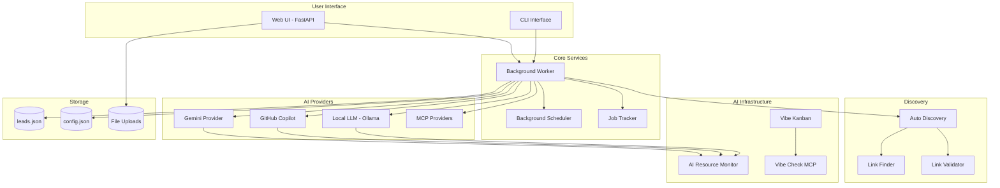
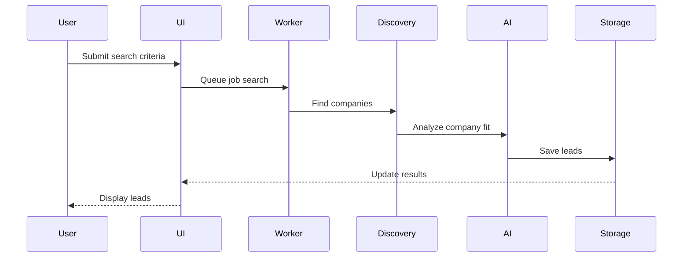
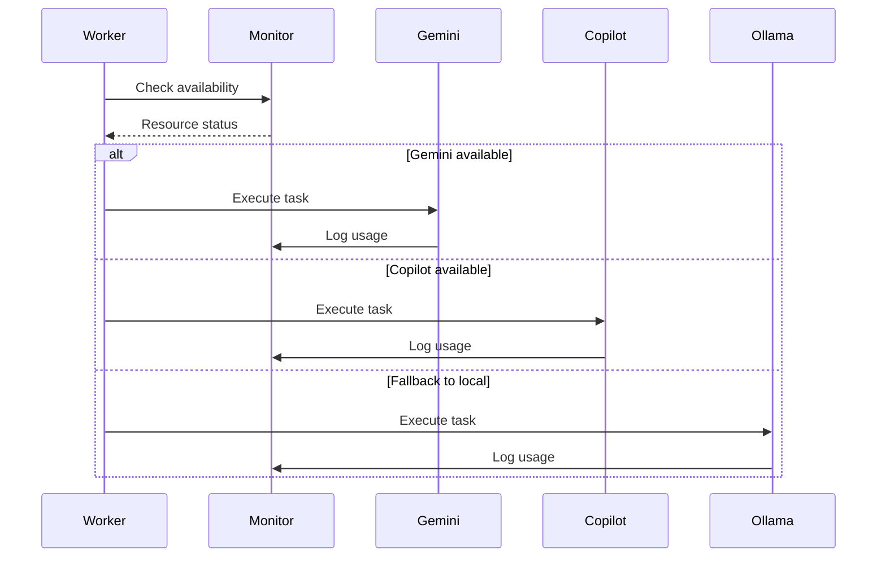

# System Architecture

## Overview
Job Lead Finder is a containerized Python application for automated job search and lead management with AI-powered analysis.

## Component Architecture

## Component Responsibilities

### 1. User Interface Layer
- **Web UI (Port 8000)**: FastAPI-based web interface for job search, tracking, and configuration
- **CLI Interface**: Command-line tools for job discovery and analysis

### 2. Core Services
- **Background Worker**: Processes job search tasks asynchronously
- **Background Scheduler**: Manages periodic tasks (auto-discovery, cleanup)
- **Job Tracker**: Stores and manages job application status

### 3. Discovery Layer
- **Link Finder**: Extracts links from web pages
- **Link Validator**: Validates and filters discovered links
- **Auto Discovery**: Automated company discovery using AI providers

### 4. AI Provider Layer
- **Gemini Provider**: Google Gemini API integration (20 req/day)
- **GitHub Copilot**: Enterprise-grade AI (1500 req/month)
- **Ollama**: Local LLM for privacy-sensitive operations
- **MCP Providers**: Model Context Protocol integrations

### 5. AI Infrastructure
- **AI Resource Monitor (Port 9000)**: Tracks AI quota usage, provides recommendations
- **Vibe Check MCP (Port 3000)**: Code validation and quality checks
- **Vibe Kanban (Port 3001)**: Task management for autonomous AI execution

### 6. Storage
- **leads.json**: Job leads database (JSON-based)
- **config.json**: Application configuration
- **uploads/**: User-uploaded files (resumes, documents)

## Data Flow

### Job Discovery Flow

### AI Resource Management Flow

## Deployment Architecture

### Containerized Services
All components run in Docker containers:

1. **app**: Main application container
2. **ui**: Web UI service (port 8000)
3. **worker**: Background worker
4. **ai-monitor**: Resource monitor (port 9000)
5. **vibe-check-mcp**: MCP validation service (port 3000)
6. **vibe-kanban**: Task management (port 3001)

### Volume Mounts
- `ai-tracking`: Persistent AI usage tracking
- `uploads`: User file uploads
- `data`: Application data (leads, config)

### Network Configuration
- Internal Docker network for service communication
- Exposed ports: 8000 (UI), 9000 (Monitor), 3000 (Vibe Check), 3001 (Kanban)

## Integration Points

### External APIs
- **Google Gemini API**: Free tier, 20 requests/day
- **GitHub Copilot**: Enterprise subscription, 1500 requests/month
- **JSearch API**: Job search aggregator (fallback)

### MCP Servers
- **Vibe Check**: Code validation via Model Context Protocol
- **Custom MCPs**: Extensible MCP provider system

## Security Considerations

1. **API Keys**: Stored in `.env` file, never committed to Git
2. **Input Validation**: All user inputs validated and sanitized
3. **Container Isolation**: Services isolated in Docker network
4. **File Uploads**: Restricted to specific directories with size limits
5. **Rate Limiting**: AI providers rate-limited to prevent quota exhaustion

## Scalability

### Current State
- Single-container deployment for each service
- JSON-based storage (sufficient for current scale)

### Future Enhancements
- Database migration (PostgreSQL) for better query performance
- Redis caching layer for AI responses
- Horizontal scaling for worker containers
- Load balancing for UI tier

## Extension Points

1. **New AI Providers**: Implement `BaseAIProvider` interface
2. **New Discovery Methods**: Extend `AutoDiscovery` class
3. **New MCP Servers**: Add to `mcp_providers.py`
4. **New Storage Backends**: Implement storage interface

---
*Last Updated: {datetime.now().strftime('%Y-%m-%d')}*
